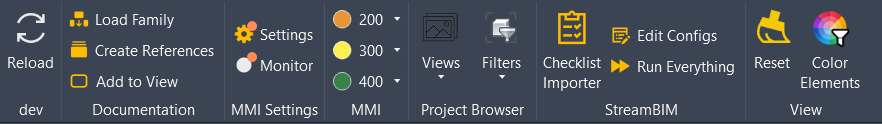

# Overview

pyByggstyrning is a pyRevit extension designed to enhance Revit workflows with some specialized tools for use in model based construction.

- **MMI Panel**: Tools for quickly setting MMI statuses on selected elements. Includes Settings for configuring MMI parameters and Monitor for automatic MMI validation, element protection, and post-sync MMI verification.
- **Project Browser Panel**: Enhanced tools for navigating and managing views and filters, credits to Giuseppe Dotto.
- **StreamBIM Panel**: Tools for StreamBIM projects for importing checklist values from site to Revit.
- **View Panel**: Color Elements tool that can help you quickly identify and select elements based on parameter values.

# Extra features

- **Quick access to MMI in the Modify tab**: The [startup.py](https://github.com/byggstyrning/pyByggstyrning.extension/blob/master/startup.py) script clones the MMI Panel into the Modify tab in Revit upon startup and document opening, providing easy access when elements are selected.
- **MMI Settings Tool**: Configure which parameter is used for MMI values and adjust monitoring options including automatic validation, element pinning, movement warnings for elements with high MMI values, and post-synchronization MMI verification.
- **MMI Monitor**: Live background monitor that can automatically validate and correct MMI values, pin elements with MMI values above 400, warn users when they attempt to move elements with high MMI status, and verify MMI compliance on user-owned elements after synchronization with central.
- **Post-Sync MMI Verification**: Automatically checks MMI parameters on user-owned model elements after synchronizing with central in workshared models. Creates a dedicated 3D view highlighting elements with missing or invalid MMI values, ensuring quality control in collaborative workflows.
- **StreamBIM API utilities**: Utilities for interacting with StreamBIM API, including authentication, project management, and checklist item retrieval. [StreamBIM utilities](https://github.com/byggstyrning/pyByggstyrning.extension/tree/master/lib/streambim).
- **Batch Importer tool**: The StreamBIM Checklist import can be automated using the 'pyrevit run' command to start revit and execute the 'Run Everything' script, this can be schedules using the .bat located in the tool folder. For more, checkout the [Batch Importer Tool](https://github.com/byggstyrning/pyByggstyrning.extension/tree/master/pyBS.tab/StreamBIM.panel/Batch%20Importer%20Tool).
- **HTTP API for Element Selection (Switchback)**: The `startup.py` also sets up an HTTP endpoint using pyRevit Routes. This allows external applications or developers to select and zoom to a specific element in Revit by its ID via a simple web request.
  - **Usage (GET Request):** `http://<revit-machine-ip>:<port>/switchback/id/<element_id>`
  - **Example:** `http://localhost:48884/switchback/id/2099173` (Port may vary based on pyRevit configuration) 
  - **Documentation:** For more details on pyRevit Routes, see the [official documentation](https://pyrevitlabs.notion.site/pyRevit-Routes-HTTP-API-79ef6d4a77b04aca9be6f4e46ffa728e).

# Installation instructions
## Extension installation

To use the extension follow the steps:

1. Install pyRevit or make sure it's already installed
2. Add pyByggstyrning extension:
   - Open command prompt (Win + R) => cmd
   - Type following command: `pyrevit extend ui pyByggstyrning https://github.com/byggstyrning/pyByggstyrning.extension.git`
   - A tab pyBS should appear on the next start of Revit

Or via the built-in extension manager in pyRevit

## Switchback-feature installation
Type following command to add support for Switchback: `pyrevit configs routes port 48884`

Or via pyRevit settings:

# Video demos

## Color Elements

https://github.com/user-attachments/assets/4628d6dd-39a4-44ff-af8b-22d1dab4f7a7

## StreamBIM Checklist Importer

https://github.com/user-attachments/assets/bf7c74ad-be95-4c0f-a815-b736b2d31a3a

## Switchback Functionality

https://github.com/user-attachments/assets/ce8b4bb5-0ae3-49b4-9656-75130f450b33

# Credits

- [Ehsan Iran-Nejad](https://github.com/eirannejad) for developing pyRevit
- [Icons8](https://icons8.com/) for its sweet icons
- [Erik Frits](https://github.com/ErikFrits) and the [LearnRevitAPI](https://learnrevitapi.com/) course
- [Giuseppe Dotto](https://github.com/GiuseppeDotto) for the Filters and Views dropdowns from the [pyM4B extension](https://github.com/GiuseppeDotto/pyM4B.extension).
- [khorn06](https://github.com/khorn06/extensible-storage-pyrevit) for the extensible storage library
